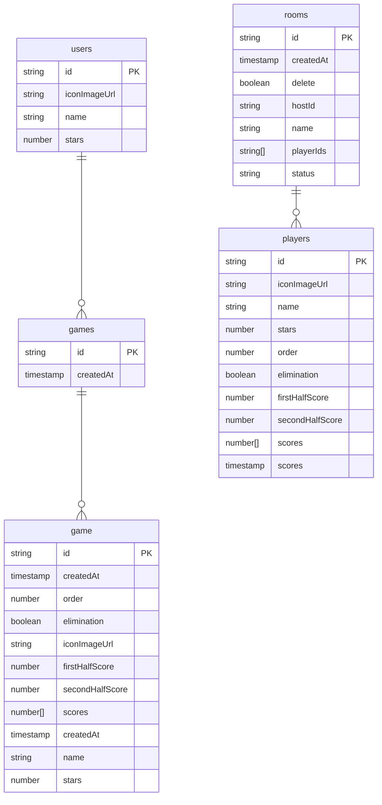

# My molkky

## 概要

モルック（molkky）というスポーツの得点管理アプリです。  
参加しているチーム毎にスマートフォン等の端末を用意し、自分の得点を記録します。  
また相手の得点はリアルタイムで反映されます。

[モルックとは](https://molkky.jp/molkky/)


### My molkkyオリジナルルール

基本的には通常のモルックのルールに加えて、下記のルールを加えています。

先に50点を先取したチームは1ポイント獲得し、そのラウンドは終了となります。
獲得したポイントはそのままで、すべてのチームの得点やスキットルの配置をリセットします。
先に2ポイント獲得したチームが勝利となり、ゲーム終了です。


## 機能一覧
- プレイルーム作成、入退室
- モルック得点管理
- ゲーム履歴閲覧

## 実装予定機能
- プレイルーム編集、削除
- プレイルームでQRコードを表示
- PWA

## 環境構築

```bash
# クローン
$ git clone https://github.com/xyytgae/my-molkky.git

# パッケージインストール
$ yarn

# localhost:3000でサーバー立ち上げ
$ yarn dev
```

## 開発中によく使うコマンド
```bash
# git czを使用しgit commitを行う
$ yarn commit
```

## 技術
- ~~Nuxt.js 2~~ → Nuxt.js 3　移行完了
- TypeScript
- Vuetify.js
- Firebase（Authentication、Firestore、Storage、Hosting）

## DeployURL

https://my-molkky.web.app


## ER図




## ディレクトリ構成

```
.
├─.firebase
├─.github
├─.husky
├─apis // コントローラー
├─assets
├─components  // 使い回すコンポーネント
├─composables
├─compositions  // provide/inject
├─constants  // 定数
├─fragments  // apiに直接アクセス可能な使い回さないコンポーネント
├─layouts
├─middleware
├─modules  // 共通関数
├─pages
├─plugins
├─static
├─tests
└─types  // TypeScriptの型

```